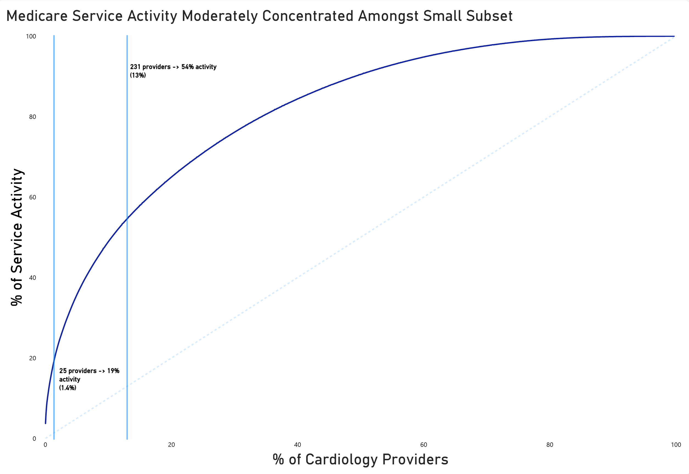

# Client Background
---
Kestrel Health partners is a fictional multi specialty medical group operating primary care and specialty care clinics across California. Kestrel is looking to **expand into specialties where it has limited footprint**. Their main target right now being Cardiology, due to the specialty's high reimbursement volume and California's aging population.

Kestrel's VP of corporate development is looking to build a data backed case for the organization's California Cardiology expansion, ahead of a board strategy session. The **goal** is to **turn CMS public provider data into market intelligence that could inform whether Kestrel should acquire an existing cardiology practice or build its own from scratch**. 
Gurkirat Singh (Data Analyst) has been assigned to lead this analysis. 

The scope of this analysis was set to the 2024 CMS Medicare Physician & Other Practitioners dataset (**containing > 9.7M rows of data**), with the insights being based around the following:

### Business Questions:

- **Who are the highest-volume cardiology providers in California right now, and how concentrated is that market — are we talking about a handful of big players or a lot of small ones?**
  
- **What are cardiologists actually billing for most? I want to understand the service mix so we know what we'd need to staff and equip if we went the "build" route.**
 
### NorthStar Metrics:

- #### Volume/Service Activity:
  - **Total Services, Total Beneficiaries, Estimated Medicare Paid**
- #### Service Mix:
  - **Medicare paid, Avg Medicare Paid, Total Services**

----
# Medicare Service Activity

  

## Notes on the Data
- There are 0 organizational cardiologist NPI's, meaning this data won't be skewed due to a data imbalance.
- Service activity reflects billed service volume not confirmed patient counts. To confirm ranking stability I cross checked against beneficiary counts and the rankings held consistently.

## Performance Overview
- As of 2024, there are 1822 unique Cardiologists accepting Medicare.
- The top 25 (1.4%) providers account for 19% of Medicare Service activity.
- Whereas the top 231 (13%) providers account for 54%.
- The top three providers provided more than 100K services with the top provider contributing 306,323 services.
- However, these numbers are being heavily inflated due to how certain services are billed. 
