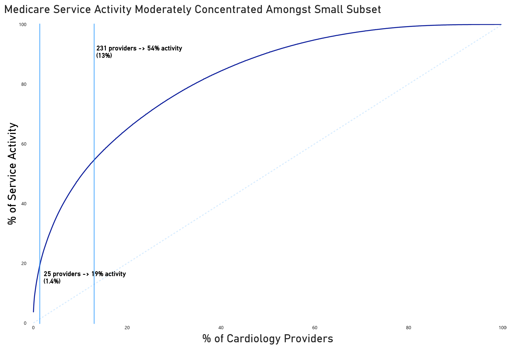
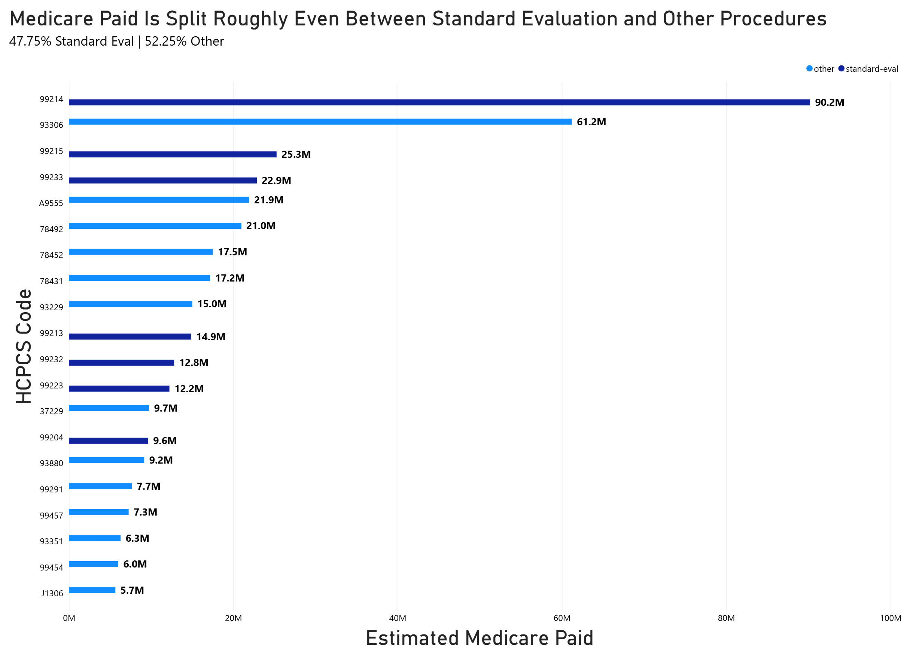

# Client Background
---
Kestrel Health partners is a fictional multi specialty medical group operating primary care and specialty care clinics across California. Kestrel is looking to **expand into specialties where it has limited footprint**. Their main target right now being Cardiology, due to the specialty's high reimbursement volume and California's aging population.

Kestrel's VP of corporate development is looking to build a data backed case for the organization's California Cardiology expansion, ahead of a board strategy session. The **goal** is to **turn CMS public provider data into market intelligence that could inform whether Kestrel should acquire an existing cardiology practice or build its own from scratch**. 
Gurkirat Singh (Data Analyst) has been assigned to lead this analysis. 

The scope of this analysis was set to the 2024 CMS Medicare Physician & Other Practitioners dataset (**containing > 9.7M rows of data**), with the insights being based around the following:

### Business Questions:

- **Who are the highest-volume cardiology providers in California right now, and how concentrated is that market — are we talking about a handful of big players or a lot of small ones?**
  
- **What are cardiologists actually billing for most? I want to understand the service mix so we know what we'd need to staff and equip if we went the "build" route. Lead with Medicare-paid, not just count. Top 20 should be plenty to tell a clean story.**

- **Based on what you find, does it look like we should be looking at acquiring an existing practice, or is there room to build our own and compete?**
  
### NorthStar Metrics:

- #### Volume/Service Activity:
  - **Total Services, Total Beneficiaries, Estimated Medicare Paid**
- #### Service Mix:
  - **Medicare paid, Avg Medicare Paid, Total Services**

----
# Medicare Service Activity

  

### Notes on the Data
- There are 0 organizational cardiologist NPI's, meaning this data won't be skewed from uneven data representation.
- Service activity reflects billed service volume not confirmed patient counts. 

### Performance Overview
- As of 2024, there are **1822 unique Cardiologists (CA)** accepting Medicare.
- The top **25 (1.4%) providers** account for **19%** of Medicare Service activity.
- Whereas, the top **231 (13%) providers** account for **54%**.
- The top three providers provided more than **100K services** with the top provider contributing **306,323 services**.
- However, these numbers are being heavily inflated due to how certain services are billed. Which is not truly reflective of clinical encounters. To confirm ranking stability, I cross checked against beneficiary counts and the rankings held consistently.

### Verdict 
- Medicare service activity is **moderate rather than extreme**. The Cardiologist market **isn't dominated by a few handful of players**, but volume is still concentrated in a small subset of high activity providers.
- Which remains **relevant for an acquisition strategy** as there is no single practice holding an outsized market share, rather a small group of the top providers do.

---
# HCPCS Code Performance Evaluation

  

### Context
- A standard evaluation service is classified based on its description. Mentions of "low/moderate/high level of decision making", "__ minutes or more", "established patient office", and no mentions of specialized equipment or machinery. 

### Overview 
- The top 20 HCPCS codes amount to a total of **$393.5 million dollars** in estimated Medicare paid.
- Of the top 20 codes, **7** described **standard evaluation services** and make up **$187.9M** of the amount **(47.74%)**.
- The 13 other codes make up **$205.6M** of the amount **(52.5%)**.
- These codes aren't classified as standard evaluation, and often mention different uses of studies, machines, or equipment.

- The split of Medicare paid based on the classification is almost even. As mentioned, a large chunk comes from standard eval services, with codes like **99214 (rank 1)** accounting for **90.2M (22.9%)** on it's own.
- However, the 13 HCPCS codes that don't describe standard eval services **still make up a majority** and can not be overlooked.

### Verdict 
- Due to the split being so close it may be that we require new equipment or capability. I'd recommend a specialist/clinical ops review of this HCPCS list prior to finalizing building costs. 

---
# Insights and Recommendations 
---
## Insights
- Based on the Medicare Service activity data, we have found that the service activity across providers is a moderate cut rather than an extreme cut. There isn't a single practice that controls a large portion of the industry.
- However, there is small group of high activity providers making up a large amount of the service activity. 
- In terms of what Cardiologists are billing for, amongst the top 20 HCPCS codes we found the split between standard evaluation services and non-standard evaluation services to be almost even.
- So, having a specialist review the list of the non-standard evaluation services and determining what would be needed to staff/equip for these codes would be a good next step.
## Recommendation
**Based on these two factors, I believe going in either direction of acquiring an existing practice or building our own both make sense. However, the real deciding factor comes down to the cost of our own build out compared to acquiring an existing practice. The data doesn't point in one obvious direction so the cost difference in both options should be heavily considered before moving forward with one or the other.**

